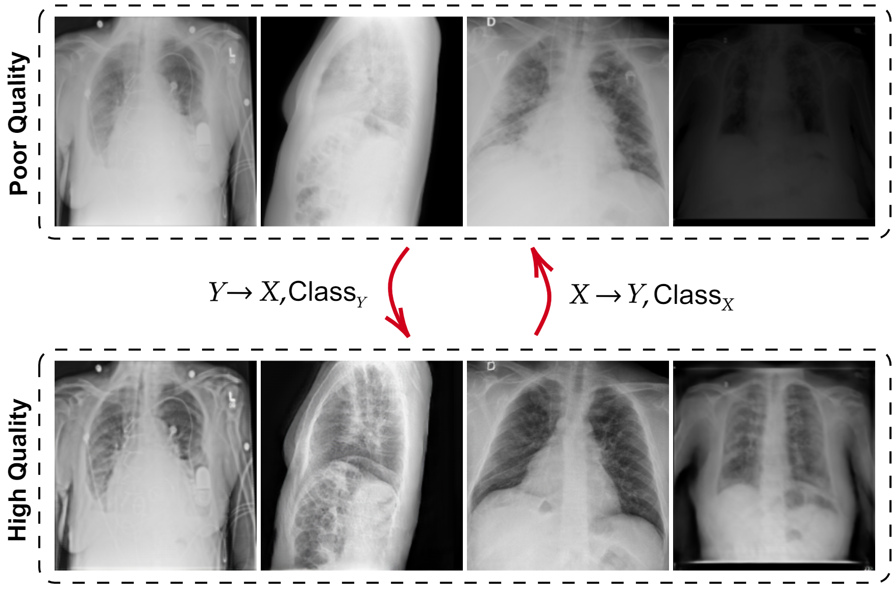

R2C-GAN: Restore-to-Classify GANs for Blind Image Restoration and Classification
=============================

This repository includes the implentation of the Restore-to-Classify GANs (R2C-GANs) proposed in [R2C-GAN: Restore-to-Classify GANs for Blind X-Ray Restoration and COVID-19 Classification](https://arxiv.org/abs/2209.14770).

<p align="center">

</p>
<p align="center">
<em>R2C-GANs jointly learn inverse and forward mappings between poor and high quality image domains <br/> and predict the class labels.</em>
</p>


Software environment:
```
# Python with the following version and libraries.

conda create -n r2c-gan python=3.9

conda activate r2c-gan

conda install tensorflow-gpu=2.4.1

conda install scikit-image tqdm scikit-learn pydot

conda install -c conda-forge oyaml

pip install tensorflow-addons==0.13.0

pip install numpy==1.19.2
```

## Citation

If you use the provided method in this repository, please cite the following paper:

```
@misc{r2cgan,
   title={R2C-GAN: Restore-to-Classify GANs for Blind X-Ray Restoration and COVID-19 Classification}, 
   author={Ahishali, Mete and Degerli, Aysen and Kiranyaz, Serkan and Hamid, Tahir and Mazhar, Rashid and Gabbouj, Moncef},
   year={2022},
   eprint={2209.14770},
   archivePrefix={arXiv},
   doi = {10.48550/ARXIV.2209.14770}
}

```

## Downloading the Dataset

We collect the dataset consisting of unpaired poor and good quality X-ray samples. The dataset is available [here](https://drive.google.com/file/d/16U6raQOhkBwGgw3pOnWbJ_4OXJe00zgu/view?usp=sharing), please download the file and unzip it:

```
unzip dataset.zip
```

## Training

The proposed R2C-GAN method can be trained as follows,
```
python train.py --method operational --q 3
```

There are three R2C-GAN models available for training: i. using operational layers ```--method operational --q 3``` where ```--q``` is the polynomial order (see [Operational Layers](https://arxiv.org/abs/2209.14770)), ii. deep R2C-GAN model with convolutional layers ```--method convolutional```, and iii. compact model with convolutional layers ```--method convolutional-light```.

## Testing

The model checkpoints for R2C-GAN (<em>Q</em> = 3), R2C-GAN (CNN), and R2C-GAN (CNN-compact) are provided in [output.zip](https://drive.google.com/file/d/1bG9YrH8vNg401KMEojCinb2bj-Ha25rr/view?usp=sharing) file, please unzip the file and place the checkpoints under ```outputs/checkpoints/``` folder to reproduce the reported results in the paper. The evaluation of the methods can be performed using the provided ```test.py``` script as follows,
```
python test.py --method operational --q 3
python test.py --method convolutional
python test.py --method convolutional-light
```
Optionally you can use ```--saveImages``` flag, e.g., ```python test.py --method operational --q 3 --saveImages True``` to store the restored images by the selected model under ```output/samples_testing``` folder.